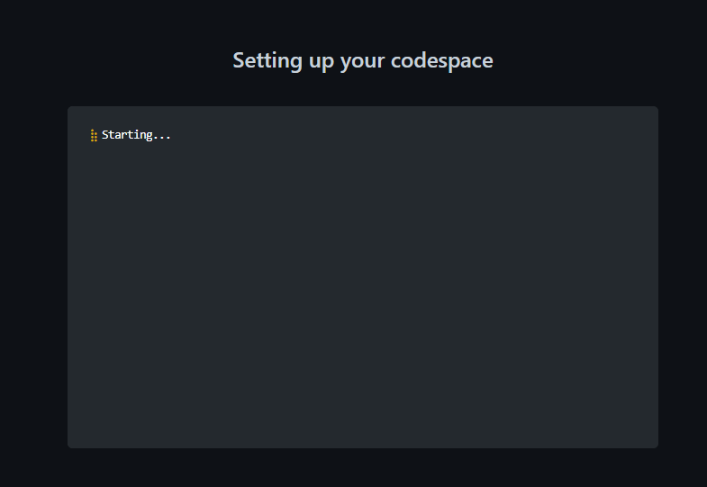

[](https://github.com/codespaces/new?hide_repo_select=true&ref=main&repo=526669888)

# Enseña Python en Codespaces

_Crea o amplia un repositorio listo para usar para enseñar Python en minutos_

Con esta plantilla puedes crear rápidamente un entorno normalizado para enseñar o aprender Python. Haz que tus estudiantes se centren en su aprendizaje en lugar de configurar su entorno. Esta plantilla utiliza Codespaces, un entorno de desarrollo alojado en la nube con [Visual Studio Code](https://visualstudio.microsoft.com/?WT.mc_id=academic-77460-alfredodeza), un poderoso editor de texto.

🤔 ¿Curioso? Mira el siguiente vídeo donde te explicamos todos los detalles:

[](https://youtu.be/7rMvb03hHpI "Teaching Python with Codespaces")

<details>
   <summary><b>🎥 Ve el video tutorial para obtener más información sobre Codespaces</b></summary>
   
   [](https://aka.ms/CodespacesVideoTutorial "Codespaces Tutorial")
</details>

🚀 Características de Codespaces:

- Entorno de nube repetible que ofrece una experiencia increíble.
- Se puede configurar y personalizar.
- Se integra con sus repositorios en GitHub y [VSCode](https://visualstudio.microsoft.com/?WT.mc_id=academic-77460-alfredodeza)

Como profesor, eso significa que puede crear un entorno, en la nube, para que en su clase todos los estudiantes puedan usar una configuración cero o casi nula, independientemente del sistema operativo que estén utilizando.

## Personalización

Personaliza tu proyecto para GitHub Codespaces al confirmar archivos de configuración en tu repositorio (a menudo conocido como _Configuration-as-Code_), lo que crea una configuración repetible de Codespaces para todos los usuarios de tu proyecto.

Puedes configurar:

- Extensiones, puedes especificar qué extensiones deben estar preinstaladas.
- Dotfiles y configuraciones.
- Bibliotecas y dependencias del sistema operativo.

> 💡 Más información sobre [personalización y configuración en la documentación oficial](https://docs.github.com/en/codespaces/customizing-your-codespace/personalizing-github-codespaces-for-your-account)


## Plantilla de Codespaces

Este repositorio es una plantilla de GitHub, la cual contiene lo siguiente:

- [example-notebook.ipynb](./example-notebook.ipynb), Este notebook utiliza la librería [Pandas](https://pandas.pydata.org/) para enseñar operaciones básicas con un pequeño archivo CSV (_Comma Separated Value_) [dataset](./wine-regions.csv)
- [.devcontainer/Dockerfile](./.devcontainer/Dockerfile), para que pueda configurar qué sistema operativo utilizará el Codespace y cómo se debe construir el contenedor.
- [.devcontainer/devcontainer.json](./.devcontainer/devcontainer.json), Un archivo de configuración utilizado por Codespaces para configurar [Visual Studio Code](https://visualstudio.microsoft.com/?WT.mc_id=academic-77460-alfredodeza), por ejemplo, para agregar y habilitar una extensión.
- `README.md`. Este archivo describe este repositorio y lo que contiene.

### 🔎 ¿Ha encontrado un problema o tienes una idea para mejorarlo?
Ayúdanos a mejorar este repositorio al [hacernos lo saber y abriendo un issue!](/../../issues/new). 

## 🧐 ¡Pruébalo!

Prueba este repositorio de plantillas con Codespaces siguiendo estos pasos:

1. Crea un repositorio desde esta plantilla. Utiliza este link [crea un repositorio](https://github.com/microsoft/codespaces-teaching-template-py/generate)
1. Ve a la página principal del repositorio recién creado.
1. Debajo del nombre del repositorio, usa el menú desplegable Código y, en la pestaña Codespaces, selecciona "Crear Codespace en main".
   
1. Se empieza a crear tu Codespace

   


### Inspeccionar el entorno de Codespaces

Lo que tienes en este momento es un entorno preconfigurado donde todos los tiempos de ejecución y bibliotecas que necesitas ya están instalados - esto es una experiencia de configuración cero.

También tienes un Jupyter Notebook que puedes comenzar a usar sin ninguna configuración.

> Este entorno se ejecutará independientemente de si tus estudiantes están en Windows, macOS o Linux.

Abre tu archivo Jupyter Notebook [example-notebook.ipynb](./example-notebook.ipynb) y observa cómo puedes agregar código y ejecutarlo.

## Personaliza tu Codespace

Hagamos cambios en tu entorno. Cubriremos dos desafíos diferentes que es probable que desees hacer:

1. Cambiar la versión de Python instalada
1. Agregar una extensión


### Paso 1: Cambiar el entorno de Python

Digamos que deseas cambiar la versión de Python que está instalada. Esto es algo que puedes controlar.

Abre [.devcontainer/devcontainer.json](./.devcontainer/devcontainer.json) y reemplaza la siguiente sección:

```json
"VARIANT": "3.8-bullseye"
```

con las siguientes instrucciones:

```json
"VARIANT": "3.9-bullseye"
```

este cambio usará Python 3.9 en lugar de 3.8.

### Paso 2: Añade una extensión

Tu entorno viene con extensiones preinstaladas. Puedes cambiar con qué extensiones comienza tu entorno de Codespaces, a continuación, te indicamos cómo:


1. Abre el archivo [.devcontainer/devcontainer.json](./.devcontainer/devcontainer.json) y busca el siguiente elemento JSON **extensions**:

   ```json
   "extensions": [
    "ms-python.python",
    "ms-python.vscode-pylance"
   ]
   ```

1. Agrega _"ms-python.black-formatter"_ a la lista de extensiones. Debería terminar pareciéndose a lo siguiente:

   ```json
   "extensions": [
    "ms-python.python",
    "ms-python.vscode-pylance",
    "ms-python.black-formatter"
   ]
   ```

   Lo que hiciste anteriormente fue agregar el identificador único de una extensión de Python [Black Formatter](https://marketplace.visualstudio.com/items?itemName=ms-python.black-formatter&WT.mc_id=academic-77460-alfredodeza). Esto permitirá a Codespaces saber que esta extensión debe estar preinstalada al iniciarse.

   Recuerda: Cuando cambies cualquier configuración en el json, aparecerá un cuadro después de guardar.

   

   Haz clic en reconstruir. Espera a que el espacio de código vuelva a generar el entorno de VS Code.

Para encontrar el identificador único de una extensión:

- Ingresa a la página web de la extensión, por ejemplo [https://marketplace.visualstudio.com/items?itemName=ms-python.black-formatter](https://marketplace.visualstudio.com/items?itemName=ms-python.black-formatter&WT.mc_id=academic-77460-alfredodeza)
- Localiza el campo *Unique Identifier* bajo la sección **More info** en tu lado derecho.


## Aprende más

- [GitHub Codespaces docs - Visión general](https://docs.github.com/en/codespaces/overview)
- [GitHub Codespaces docs - Comienza rapido](https://docs.github.com/en/codespaces/getting-started/quickstart)

